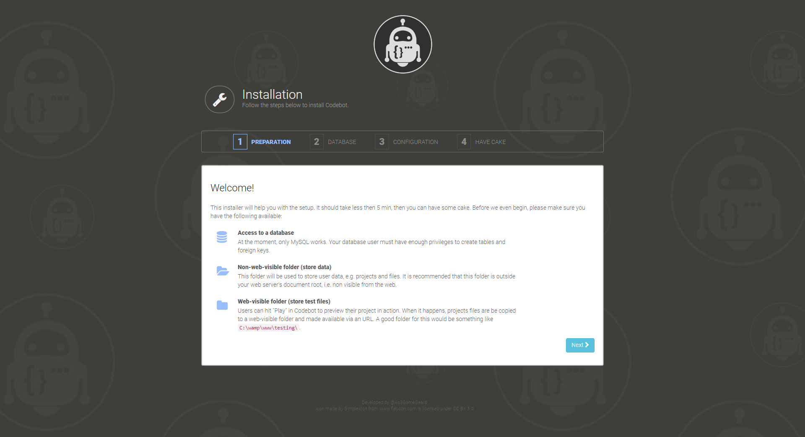

# Codebot

Codebot is a free and open source (MIT license) web-based IDE focused on game development.


> **NOTICE: if you would like to try Codebot, check out the free and online [demo](https://codebot.cc) available at [https://codebot.cc](https://codebot.cc)**

Simply put Codebot is a code editing program equipped with built-in tools for gamedev, all running on the cloud. It aims to help you make your game, no matter where you are or the equipment you have (read full thoughts [here](http://www.as3gamegears.com/blog/codebot-an-ide-focused-on-gamedev/)).

Developing a game is much more than just coding, you have to tweak art, build levels, convert files, find assets/extensions, read docs about building and publishing, and so on. IDEs should help with those tasks, or do them automatically. Imagine you are working on a [Ludum Dare](http://www.ludumdare.com/)/[1GAM](http://onegameamonth.com) game and you need an 8-bit SFX. You click a button, a panel slides, you type in a few keywords, select what you want and done! You have the SFX ready for use. That's the idea behind Codebot.

## Table of content

- [Features](#features)
- [Getting started](#getting-started)
	- [Prerequisites](#prerequisites)
	- [Installing](#installing)
	- [Configuring](#configuring)
	- [Usage](#usage)
- [Contribute](#contribute)
- [License](#license)
- [Changelog](#changelog)
- [Similar projects](#similar-projects)

## Features

* Full-featured code editor.
* Support for Javascript projects ([Haxe](https://haxe.org/) coming soon!).
* Files panel (drag/rename/move files around).
* Built-in 8-bit SFXs panel.
* Built-in assets finder panel (currently works with a curated list of [opengameart.org](https://opengameart.org)).
* View different file types (images, sounds, text).
* Projects manager.
* Support for plugins.
* Built using web technologies, ready to run on the cloud.

## Getting started
### 1. Prerequisites

You need a webserver with [PHP](http://php.net) support, and [MySQL](https://www.mysql.com/) to run Codebot.

### 2. Installing

Go to the `DocumentRoot` folder of your webserver, e.g. `/var/www/` on Ubuntu or `C:\wamp\www` on Windows:

```
cd /var/www
```

Clone [Codebot's repository](https://github.com/Dovyski/Codebot) (including submodules):

```
git clone --recursive https://github.com/Dovyski/Codebot.git codebot
```

From this point on, you can continue the installation and configuration using Codebot web-based installer. Just access `http://localhost/codebot` and follow the instructions, it will take less then 5 min:



### 3. Configuring

Codebot has several files that are used for configuration. The one responsible for the back-end configuration is `/plugins/ide-web/config.php`. The best practice is to create a local configuration file named `config.local.php`, i.e. `/plugins/ide-web/config.local.php`, that overrides only the directives you want to change.

If you used Codebot web-based installer, you already have the `/plugins/ide-web/config.local.php` file created for you. You can edit the `config.local.php` file anytime to meet your needs, e.g. to adjust Oauth credentials, debug mode, etc.

By default, the directives `CODEBOT_DEBUG_MODE` and `CODEBOT_DEV_MODE` will be set to `true`, which makes Codebot run in development mode. When in such mode, local authentication without username or password is allowed.

***WARNING: if CODEBOT_DEV_MODE directive is set to `true` in production, your server/users might be at risk!***

### 4. Usage

After installing and configuring Codebot, visit `http://localhost/codebot` and start enjoying a cloud-based gamedev environment. If `CODEBOT_DEV_MODE` is set to `true` (default), you will have the option to login without providing a username or a password.

## Contribute

The development process is a little bit rough right now. It's basically me coding and changing things a lot, documenting things very superficially along the way. At some point, the APIs will stabilize and it will be a lot easier to join the party.

If you want to help now, you can take Codebot for a ride and send me your feedback, or suggest a feature, or send a "cool!"/"insane!" motivational message :). Just ping me at [@as3gamegears](http://twitter.com/as3gamegears) or [open an issue](https://github.com/Dovyski/Codebot/issues/new).

## License

Codebot is licensed under the terms of the [MIT](https://choosealicense.com/licenses/mit/) Open Source
license and is available for free.

## Changelog

See all changes in the [CHANGELOG](CHANGELOG.md) file.

## Similar projects

Codebot is by no means a novel idea. Below are a few projects that are similar to Codebot, i.e. web-based IDE/code editor.

* [Theia](https://github.com/theia-ide/theia)
* [CodeSandbox](https://codesandbox.io)
* [Stackblitz](https://stackblitz.com)
* [Codebox](https://github.com/CodeboxIDE/codebox)
* [Cloud9](https://c9.io)
* [Ace](https://ace.c9.io)
* [Monaco](https://microsoft.github.io/monaco-editor)
